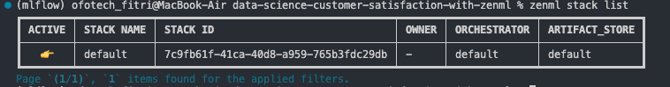
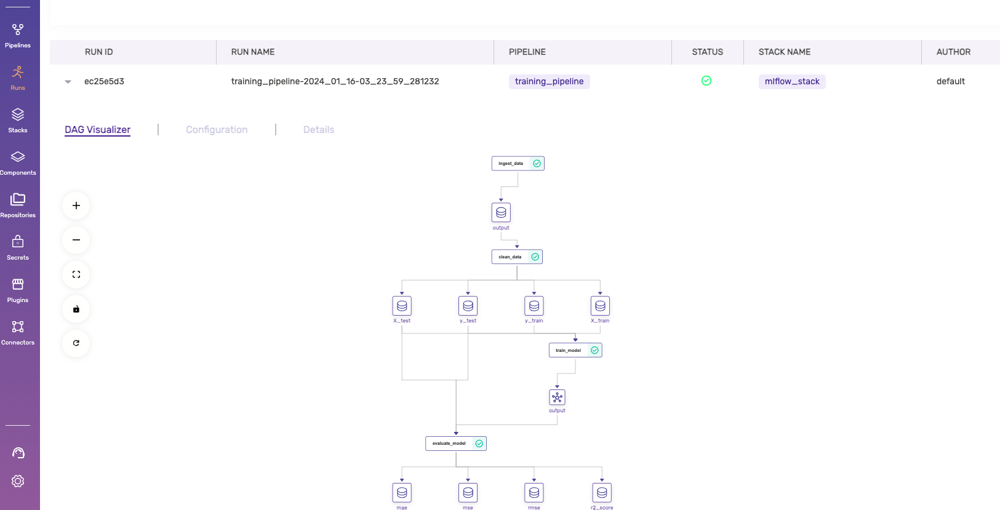
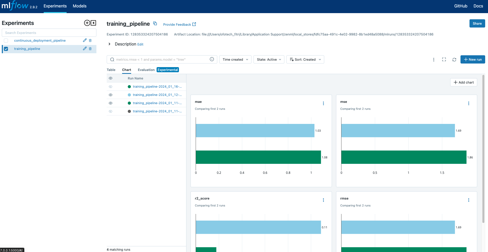
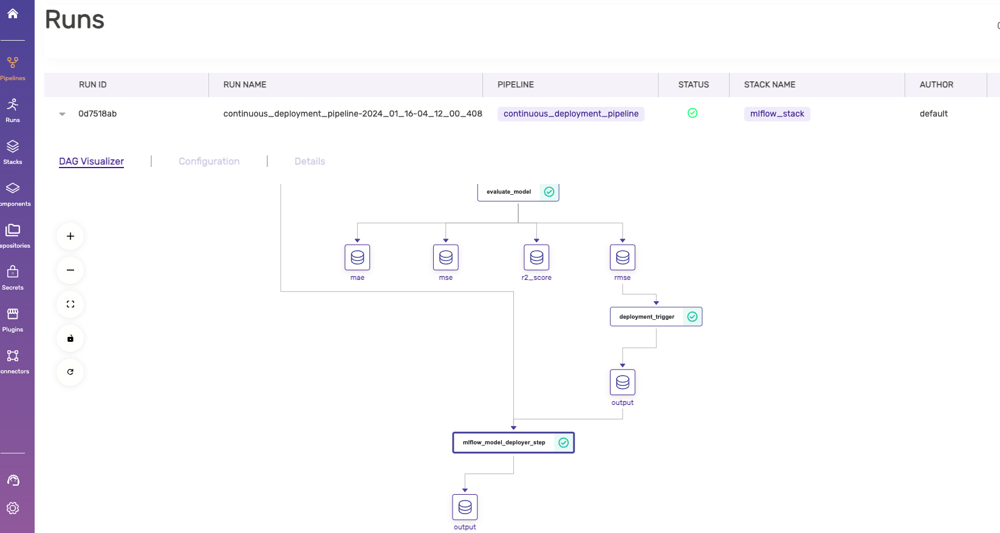

# THE PROJECT:

The purpose of this repository is to demonstrate how [ZenML](https://github.com/zenml-io/zenml) empowers your business to build and deploy machine learning pipelines in a multitude of ways:

- By offering you a framework and template to base your own work on.
- By integrating with tools like [MLflow](https://mlflow.org/) for deployment, tracking and more
- By allowing you to build and deploy your machine learning pipelines

# THE DATASET

Predicting how a customer will feel about a product before they even ordered it.

**Problem statement**: For a given customer's historical data, we are tasked to predict the review score for the next order or purchase. We will be using the [Brazilian E-Commerce Public Dataset by Olist](https://www.kaggle.com/datasets/olistbr/brazilian-ecommerce). This dataset has information on 100,000 orders from 2016 to 2018 made at multiple marketplaces in Brazil. Its features allow viewing charges from various dimensions: from order status, price, payment, freight performance to customer location, product attributes and finally, reviews written by customers. The objective here is to predict the customer satisfaction score for a given order based on features like order status, price, payment, etc. In order to achieve this in a real-world scenario, we will be using [ZenML](https://zenml.io/) to build a production-ready pipeline to predict the customer satisfaction score for the next order or purchase.

# PREREQUISITE - INITIAL SETUP

## :snake: Python Requirements

Let's jump into the Python packages you need. Within the Python environment of your choice, run:

```bash
git clone
pip install -r requirements.txt
```

Starting with ZenML 0.20.0, ZenML comes bundled with a React-based dashboard. This dashboard allows you
to observe your stacks, stack components and pipeline DAGs in a dashboard interface. To access this, you need to [launch the ZenML Server and Dashboard locally](https://docs.zenml.io/user-guide/starter-guide#explore-the-dashboard), but first you must install the optional dependencies for the ZenML server:

```bash
pip install zenml["server"]
zenml init
zenml up
```

## ZenML & MLFlow Integration Setup

Refer to [MLFlow integration with ZenML](https://docs.zenml.io/stacks-and-components/component-guide/experiment-trackers/mlflow)
If you are running the `run_deployment.py` script, you will also need to install some integrations using ZenML:

```bash
zenml integration install mlflow -y
```

The project can only be executed with a ZenML stack that has an MLflow experiment tracker and model deployer as a component. Configuring a new stack with the two components are as follows:

```bash
zenml integration install mlflow -y
# Register the MLflow experiment tracker
zenml experiment-tracker register my_mlflow_experiment_tracker --flavor=mlflow
zenml model-deployer register my_mlflow_experiment_tracker --flavor=mlflow
# Register and set a stack with the new experiment tracker
zenml stack register mlflow_stack -a default -o default -d my_mlflow_experiment_tracker -e my_mlflow_experiment_tracker --set
```

To check the zenml stack list


```bash
zenml stack list
```

# PROJECT SECTIONS

There are 2 options to run the project:

## 1. TRAINING PIPELINE.

This section enable to run the project pipeline from ingesting dataset, cleaning dataset, model training and evaluation.
The pipeline and steps are configured using ZenML. It can be viewed on ZenML UI Dashboard!
The model evaluation and experiment can be monitored through MLFlow Integration.

### STEPS FOR TRAINING PIPELINE

#### STEP 1:

Clean your dataset.

- Copy and store your dataset in 'data' folder.
- Experiment on your dataset under folder 'research/data_cleaning.ipynb'.
- Do the standard data exploration procedure, not limited to:
  - Check data shape
  - Check data size
  - Check data type
  - Check duplication
  - Check empty rows
  - etc.
- Do the standard data cleaning & feature engineering on the dataset, not limited to:
  - Rename column
  - Remove unnecessary column (drop column)
  - Handle missing data (fillna) or remove rows
  - Convert categorical to numerical (Label Encoding, One-hot-Encoding)
  - Normalization (rescale to 0-1) or Standardization (Scaling to have zero mean and unit variance)
  - Binning Process
  - Correlation Analysis, if needed to remove any uncorrelated column
  - Handle outliers (Trimming, transformation (log transform for example))

#### STEP 2:

Apply the data processing process in code base on "src/data_cleaning.py". Use the necessary data processing functions accordingly on the ingested data.

#### STEP 3:

Select the necessary model for training on "config/configuration.py".

#### STEP 4:

Activate zenml server:

```bash
zenml up
```

#### STEP 5:

Run the training pipeline:

```bash
python run_pipeline.py
```

#### VIEW PIPELINE ON ZenML

Upon running run_pipeline.py, local ZenML server (http://127.0.0.1:8237) will appear:



#### VIEW MODEL EXPERIMENT ON MLFLOW

Upon running run_pipeline.py, mlflow ui url will be displayed on log. Copy the whole line and run on terminal e.g.:

```bash
 mlflow ui --backend-store-uri 'LOCAL URI'
```

You may click on the local MLFlow server displayed on terminal e.g http://127.0.0.1:5000:
You may review and compare various model performance on MLFlow UI



## 2. DEPLOYMENT PIPELINE.

This section enable to run the project pipeline from ingesting dataset, cleaning dataset, model training, evaluation including deployemnt to MLFlow Deployment.
The model shall only be deployed if the evaluation parameters requirements are meet. (e.g rmse > 0.9)

### STEPS FOR DEPLOYMENT PIPELINE

Follow the same step on the TRAINING PIPELINE from Step 1 until Step 4.

#### STEP 5:

To set the requirement for deployment to be executed, edit "pipelines/deployment_pipeline.py" Line 77 and 78 accordingly:

```bash
    mae, mse, rmse, r2_score = evaluate_model(model, X_test, y_test)
    deployment_decision = deployment_trigger(accuracy=rmse)
```

and the min_accuracy value on "pipelines/deployment_pipeline.py":

```
    class DeploymentTriggerConfig(BaseParameters):
        """Define class for deployment pipeline configuration"""

        min_accuracy: float = 0.92
```

#### STEP 6:

Run the deployment pipeline:

```bash
python run_deployment.py
```

#### VIEW PIPELINE ON ZenML

Upon running run_deployment.py, local ZenML server (http://127.0.0.1:8237) will appear:



#### VIEW MODEL EXPERIMENT ON MLFLOW

Upon running run_deployment.py, mlflow ui url will be displayed on log. Copy the whole line and run on terminal e.g.:

```bash
 mlflow ui --backend-store-uri 'LOCAL URI'
```

You may click on the local MLFlow server displayed on terminal e.g http://127.0.0.1:5000:
You may review and compare various model performance on MLFlow UI

# DEBUG/ISSUES

1. ZenML Connection Error
   If you get the following error:

```
ConnectionError: ('Connection aborted.', RemoteDisconnected('Remote end closed connection without response'))
```

Just reconnect the zenml server:

```bash
 zenml down
 zenml up
```

# REFERENCE

[Source 1](https://www.analyticsvidhya.com/blog/2023/10/a-mlops-enhanced-customer-churn-prediction-project/)
